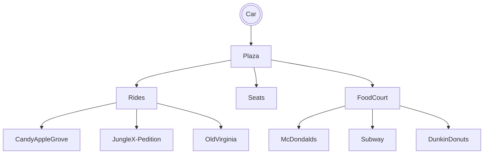

# Yareds Kings Dominion Trip

## Setting
This game takes place at Kings Dominion. The user will be able to go around Kings Dominion and do fun things.

## Map

## Story
When the user arrives, the goal is for the user to do everything they can to have a fulfiled day at King's Dominion without throwing up from any rides or food. The game will start at 12pm, and each activity they do will cost them a different amount of time until they have to leave at 5:00, the main options will be to wait around at the center for 15 minutes of their time, getting food taking 20 minutes of their time, and going on a ride which will take 30 minutes of their time. If they throw up then they go home early, but if they make it until 5:00 then they have a fulfilled day.

## Global variables
The global variables I will use firstly is time, in order to keep track of the user for the 5 hours they have. Secondly their will be a boolean for if they just went on a ride, if they went on a ride then went to get food it will check if that boolean is true, and if it is then they throw up and lose the game. Lastly, their will be a ride counter for each ride they go on, if they don't go on atleast 3 rides then they leave dissapointed and technically lose the game.
